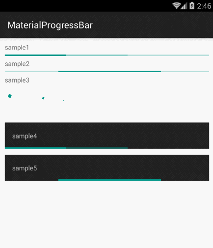

# MaterialProgressBar
 
## apk
[MaterialProgressBar-1.0.3-sample.apk](https://github.com/Sing1/MaterialProgressBar/blob/master/app.apk)
## gradle:
```groovy
dependencies {
    ...
    compile 'com.sing.materialprogressbar:library:1.0.3'
}
```
## Maven:
```xml
<dependency>
  <groupId>com.sing.materialprogressbar</groupId>
  <artifactId>library</artifactId>
  <version>1.0.3</version>
  <type>aar</type>
</dependency>
```
## sample
1、sample1
```xml
<com.sing.MaterialProgressBar
    style="@style/Widget.MaterialProgressBar.ProgressBar.Horizontal"
    android:layout_width="match_parent"
    android:layout_height="wrap_content"
    android:progress="30"
    android:secondaryProgress="60"
    app:mpb_progressStyle="horizontal" />
    
<style name="Widget.MaterialProgressBar.ProgressBar.Horizontal" parent="android:Widget.ProgressBar.Horizontal">
    <item name="android:indeterminateDrawable">@null</item>
    <item name="android:minHeight">16dp</item>
    <item name="android:maxHeight">16dp</item>
</style>
```
